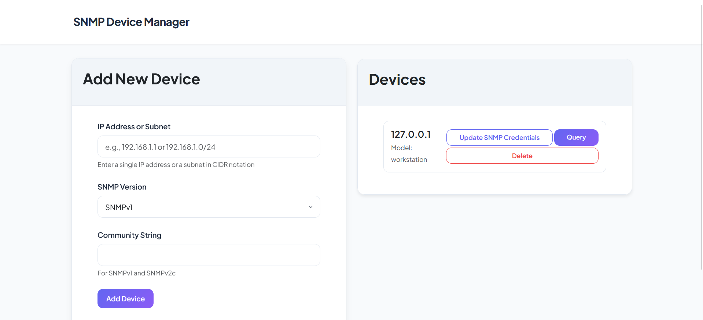
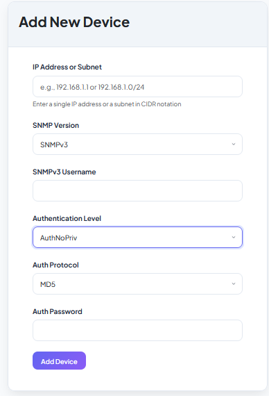
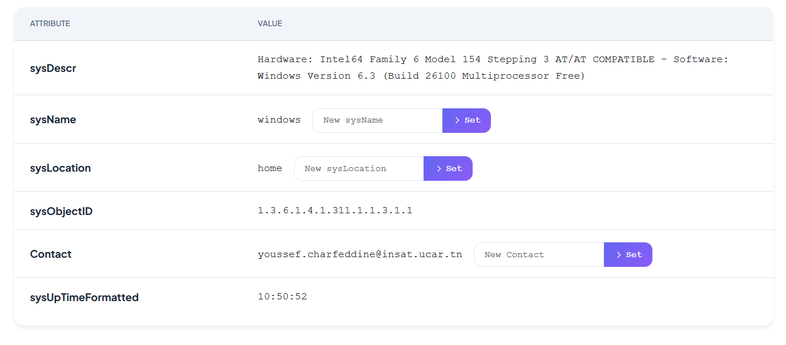
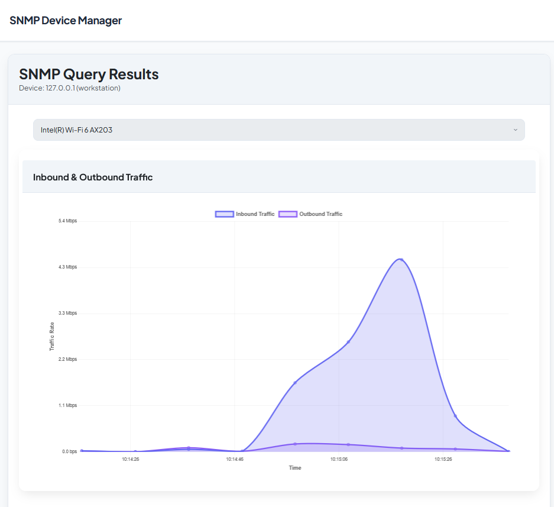

# SNMP Monitoring Web Application

A professional-grade SNMP monitoring solution built with Python and Flask, designed for systems administrators and network engineers who require efficient visibility into their network infrastructure. This application supports SNMP versions 1, 2c, and 3, and provides real-time insights into devices, interfaces, and traffic — all from an intuitive web-based interface.

---

## Features



- **Full SNMP v1/v2c/v3 Support**  
  Query SNMP-enabled devices regardless of version, with support for authentication and encryption (v3).

- **Subnet Scanning**  
  Automatically discover and list all devices with active SNMP agents in a given subnet range.

- **Manual Device Addition**  
  Add devices individually with custom SNMP credentials and preferences.



- **OID Query Interface**  
  Interact with and retrieve critical information from any device via key OIDs, with elegant UI formatting.

- **Writable OIDs**  
  Modify device configuration (where supported) through safe and validated SNMP write operations.



- **Device Identification**  
  Automatically detects and displays the device manufacturer and model based on SNMP system object identifiers.

- **Interface Monitoring**  
  View active interfaces and real-time inbound/outbound traffic in bits per second.

- **Graphical Interface Visualization**  
  Easily select an interface from a dropdown and visualize live traffic graphs for monitoring bandwidth usage.



---

## Technology Stack

- **Backend:** Python 3.7, Flask  
- **Frontend:** HTML, CSS, Vanilla JS (optionally extendable)  
- **Database:** SQLite (devices.db and models.db)  

---

## Requirements

- Python 3.7  
- `pip` (Python package manager)  
- A working SNMP network to monitor  
- Basic knowledge of SNMP community strings or credentials

---

## Installation

1. **Clone the repository**

```bash
git clone https://github.com/youssefnoob003/Snmp-app.git
cd Snmp-app
```

2. **Create a virtual environment (optional but recommended)**

```bash
python3.7 -m venv venv
source venv/bin/activate   # On Windows: venv\Scripts\activate
```

3. **Install dependencies**

```bash
pip install -r requirements.txt
```

5. **Run the application**

```bash
python run.py
```

Access the web app by navigating to:  
[http://localhost:5000](http://localhost:5000)

---

## File Structure Overview

```
app/
│
├── templates/                  # HTML templates
├── static/                     # CSS, JS, and assets
├── routes/                     # Blueprint routes for modular design
├── services/                       # SNMP utility functions
├── __init__.py                 # Flask app factory
├── devices.db                  # Main runtime database for devices
run.py                          # Entry point for the Flask app
config.py                       # App configuration and paths
requirements.txt                # Python dependencies
models.db                       # Database for SNMP MIBs/models
```

---

## Why This Project Stands Out

This SNMP application is engineered with extensibility and maintainability in mind. Whether you're scanning a data center subnet or monitoring a critical device in the field, this tool simplifies complex SNMP interactions into meaningful, visual insights. It offers both automation and manual control, wrapped in a minimal yet powerful user interface. Its architecture supports rapid deployment, ease of configuration, and future upgrades (e.g., Docker, role-based auth, remote storage).

---

## Contributing

Contributions are welcome. Please open an issue or submit a pull request if you have feature suggestions, bug fixes, or improvements to propose.

